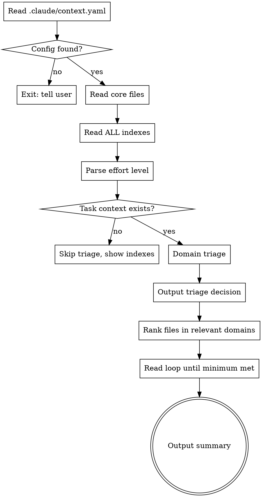

# Context Engineering

Load project context from index files before working. You MUST actually read the files -- not skim, not summarize, not say "I'll read this" and then skip it.

## How It Works



## Arguments

- No argument: default minimum 10 files
- A number (e.g., `25`): read at least that many files
- `deep`: read ALL files from relevant domains

## Step-by-Step Process

### Step 1: Read config

Read `.claude/context.yaml` from the project root. If not found, tell the user and stop.

The config has two sections:

```yaml
core:        # Always-read files (flat list of paths)
  - WORKSTATE.md

indexes:     # Named domains pointing to index files
  domain-name:
    path: path/to/INDEX.md
    summary: One-line description for triage
```

### Step 2: Read core files

Read every file in the `core` list using the Read tool. No reasoning, no skipping. These are universally relevant.

### Step 3: Read ALL indexes

Read every index file listed under `indexes`. For each index, extract:
- Markdown links: `[Title](path)` -- the path is the file, resolved relative to the index file's directory
- Summary text: anything after the link on the same line (e.g., `-- description here`)
- Also support bare paths as fallback

Build a complete map: domain -> list of (file_path, display_name, summary, size).

Index entries may include file sizes: `[Title](path) (2.1 KB) -- summary`. Use sizes to estimate token budget. If total files to read would exceed ~200 KB, prioritize smaller high-relevance files first and warn the user about the large context load.

### Step 4: Determine effort level

Parse the argument:
- No arg -> minimum = 10
- Number -> minimum = that number
- "deep" -> read all from relevant domains
- Invalid -> show usage: `/context-engineering [number|deep]` and stop

### Step 5: Domain triage

If the user has stated a task (look at their message before this skill was invoked):
- Review each domain's `summary` from context.yaml
- Classify each domain as RELEVANT or SKIP based on the task
- Output the decision so the user can course-correct:

> **Relevant domains:** marketing, website, reference
> **Skipped:** coaching-reference, submeta, podcast-transcripts, hubs

If the user has NOT stated a task yet:
- Load core files and indexes only
- Tell the user: "Context indexes loaded. State your task and re-invoke, or I'll use all domains."
- Stop here

### Step 6: Rank files

Within relevant domains, rank all files by relevance to the task using the summaries extracted from the indexes.

### Step 7: Read loop

Read files in rank order. Use the Read tool for each file. Count each file read.

**Keep reading until the minimum is met.** Do not stop early. Do not say "I have enough context." If the minimum is 10, you read 10 files minimum. If "deep", read every file from every relevant domain.

Core files do NOT count toward the minimum.

<HARD-RULE>
You MUST hit the minimum file count. Not approximately. Not "close enough."
If there are fewer files available than the minimum, read everything available and note the shortfall.
</HARD-RULE>

### Step 8: Summary

Output what was loaded:
- Which domains were selected and why
- List of files read, grouped by domain
- The summary from the index for each file (do not re-summarize the content yourself)
- Total file count

## Edge Cases

- **Index not found:** Warn, continue with remaining indexes
- **File from index not found:** Warn, skip, continue. Do not fail the whole run.
- **Fewer files than minimum:** Read everything available. Note: "Only N files available across relevant domains (minimum was M)."

## Red Flags -- STOP If You Catch Yourself Thinking

| Thought | Reality |
|---------|---------|
| "I already know enough" | You don't. Hit the minimum. |
| "I'll read the rest later" | You won't. Read them now. |
| "This file probably isn't relevant" | The index summary says otherwise. Read it. |
| "Let me just start on the task" | That's the exact failure mode this skill exists to prevent. |
| "I can skim this one" | Read it. The user invoked this skill because skimming doesn't work. |
| "10 files is a lot" | 10 files is the MINIMUM. The user chose this number because you read too few without it. |
